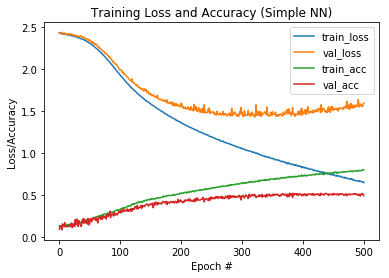
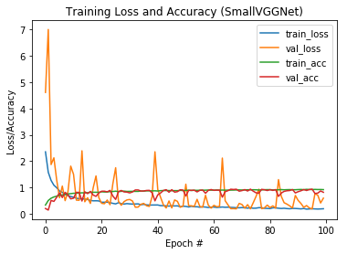

# V2-Plant Seedling classification !

Made a Simple FeedForward Neural network to classify the pulse based on their seed. The simple feedforward network gave an accuracy of 50% .

```python
print("[INFO] evaluating network...")
predictions = model.predict(testX, batch_size=32)
print(classification_report(testY.argmax(axis=1),predictions.argmax(axis=1), target_names=lb.classes_))
 
# plot the training loss and accuracy
N = np.arange(0, EPOCHS)
plt.figure()
plt.plot(N, h.history["loss"], label="train_loss")
plt.plot(N, h.history["val_loss"], label="val_loss")
plt.plot(N, h.history["acc"], label="train_acc")
plt.plot(N, h.history["val_acc"], label="val_acc")
plt.title("Training Loss and Accuracy (Simple NN)")
plt.xlabel("Epoch #")
plt.ylabel("Loss/Accuracy")
plt.legend()
```

    [INFO] evaluating network...
                               precision    recall  f1-score   support
    
                  Black-grass       0.28      0.29      0.29        72
                     Charlock       0.65      0.71      0.68       106
                     Cleavers       0.63      0.49      0.55        79
             Common Chickweed       0.45      0.72      0.55       190
                 Common wheat       0.27      0.09      0.13        67
                      Fat Hen       0.45      0.40      0.43       151
             Loose Silky-bent       0.53      0.52      0.52       176
                        Maize       0.65      0.41      0.50        76
            Scentless Mayweed       0.50      0.39      0.44       152
             Shepherd’s Purse       0.51      0.42      0.46        67
    Small-flowered Cranesbill       0.71      0.69      0.70       134
                   Sugar beet       0.32      0.41      0.36       115
    
                    micro avg       0.50      0.50      0.50      1385
                    macro avg       0.50      0.46      0.47      1385
                 weighted avg       0.50      0.50      0.49      1385
    
    


    <matplotlib.legend.Legend at 0x7f3d5c2fea58>





```python
image = cv2.imread('../input/nonsegmentedv2/Maize/1.png')
output = image.copy()
image = cv2.resize(image, (32,32))
image = image.astype('float') / 255
image = image.flatten()
image = image.reshape((1, image.shape[0]))
image.shape
```


    (1, 3072)


```python
preds = model.predict(image)
i = preds.argmax(axis=1)[0]
label = lb.classes_[i]
print(preds, label)
```

    [[1.3442568e-09 4.9521925e-04 3.7400387e-05 3.4356201e-01 1.0232309e-06
      4.1861783e-04 2.7475547e-10 5.7527393e-01 4.8484888e-02 2.6156032e-02
      1.8871131e-05 5.5519738e-03]] Maize
    

#### As we can see that the model produces the right result for the image , which is maize. But still using a Simple feedforward neural network might not be the ideal solution, thus we are going to use CNN, VGGNet architechture  to be precise.

---

Then I made my own implementation of the VGGNet architechture, which gave a val_accuracy of 83%.


```python
# evaluate the network
print("[INFO] evaluating network...")
predictions = model.predict(testX, batch_size=32)
print(classification_report(testY.argmax(axis=1),
                            predictions.argmax(axis=1), target_names=lb.classes_))
 
# plot the training loss and accuracy
N = np.arange(0, EPOCHS)
plt.figure()
plt.plot(N, h.history["loss"], label="train_loss")
plt.plot(N, h.history["val_loss"], label="val_loss")
plt.plot(N, h.history["acc"], label="train_acc")
plt.plot(N, h.history["val_acc"], label="val_acc")
plt.title("Training Loss and Accuracy (SmallVGGNet)")
plt.xlabel("Epoch #")
plt.ylabel("Loss/Accuracy")
plt.legend()
```

    [INFO] evaluating network...
                               precision    recall  f1-score   support
    
                  Black-grass       0.58      0.64      0.61        72
                     Charlock       0.86      0.95      0.90       106
                     Cleavers       1.00      0.81      0.90        79
             Common Chickweed       0.93      0.92      0.92       190
                 Common wheat       0.93      0.78      0.85        67
                      Fat Hen       0.95      0.81      0.87       151
             Loose Silky-bent       0.90      0.76      0.82       176
                        Maize       0.54      0.99      0.70        76
            Scentless Mayweed       0.90      0.68      0.77       152
             Shepherd’s Purse       1.00      0.67      0.80        67
    Small-flowered Cranesbill       0.95      0.93      0.94       134
                   Sugar beet       0.57      0.87      0.69       115
    
                    micro avg       0.82      0.82      0.82      1385
                    macro avg       0.84      0.82      0.82      1385
                 weighted avg       0.86      0.82      0.83      1385
    
    


    <matplotlib.legend.Legend at 0x7f3d406ae9e8>


